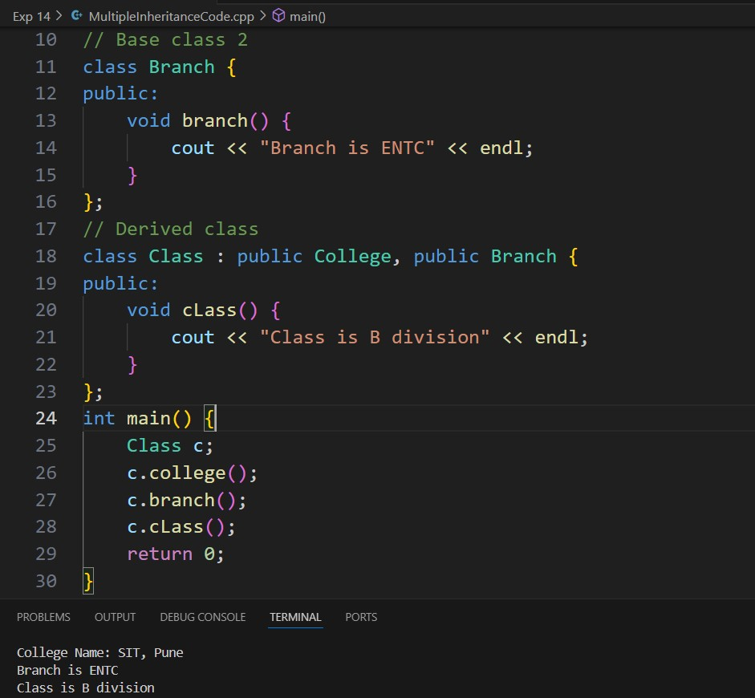
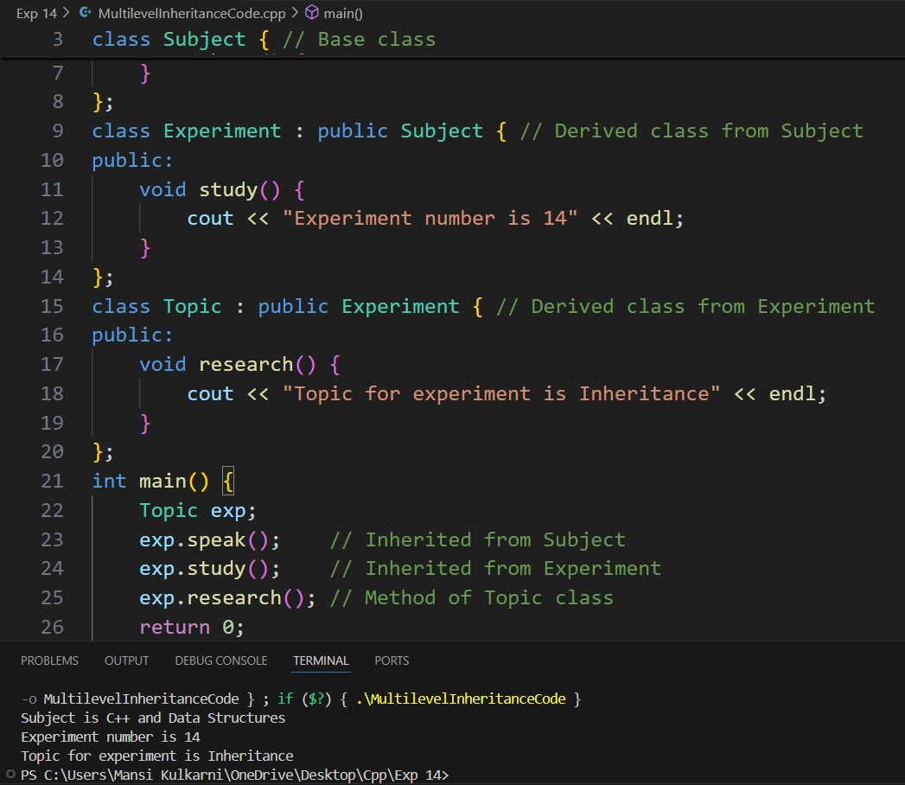
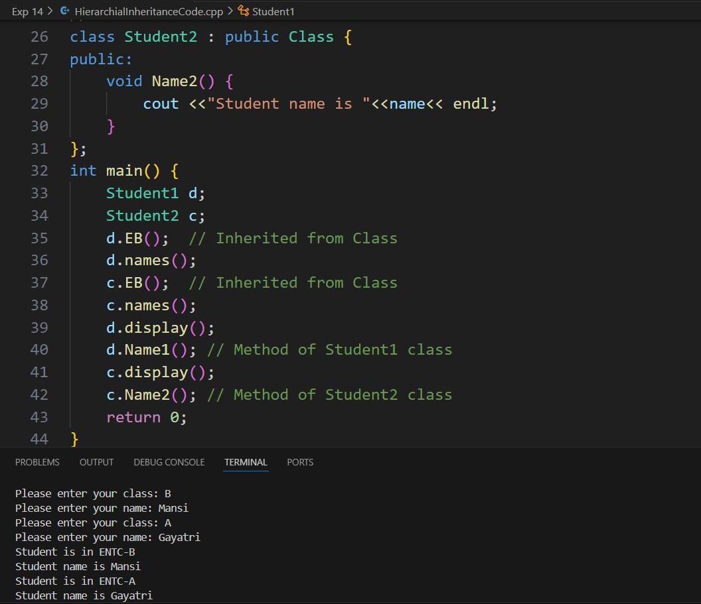

# Experiment 3
## Program 1
### Aim: 
To study Single Inheritance
### Software used: 
Visual Studio Code
### Theory:
In single inheritance, a class (derived class) inherits from one and only one base class. This is the simplest form of inheritance where a child class derives attributes and methods from a single parent class, allowing code reuse and extension of functionality from the base class.
###
The derived class has access to the public and protected base class members.
Encourages code reuse and simplicity in class design.
### Output:

### Conclusion:
We learned about single inheritance in C++. 

## Program 2
### Aim: 
To study Multiple Inheritance. 
### Software used: 
Visual Studio Code
### Theory:
A class can inherit from multiple base classes in multiple inheritance. This allows a derived class to combine functionalities from multiple parent classes. Although powerful, multiple inheritance can lead to complexities, especially in cases of name conflicts or ambiguity when the same method or attribute exists in more than one base class.
###
The derived class inherits from two or more base classes.
This can lead to the "diamond problem," where ambiguity arises from multiple inheritance paths.
Requires careful design to avoid conflicts and maintain clarity.
### Output:

### Conclusion:
We learned about multiple inheritance in C++. 

## Program 3
### Aim: 
To study Multilevel Inheritance
### Software used: 
Visual Studio Code
### Theory:
In multilevel inheritance, a class inherits from a derived class, creating a chain of inheritance. This means one class is derived from another derived class. Each class can build upon the functionality of the previous class, creating a hierarchical structure.
### 
Classes inherit from one another in a chain.
Promotes a clear hierarchical structure.
Each derived class inherits the properties and methods of all preceding base classes.
### Output:

### Conclusion:
We learned about multilevel inheritance in C++

## Program 4
### Aim: 
To study Hierarchical Inheritance
### Software used: 
Visual Studio Code
### Theory:
In hierarchical inheritance, multiple derived classes inherit from a single base class. This means that one parent class has more than one child class. Each derived class can have its own unique features, in addition to the attributes and methods inherited from the common base class.
### 
One base class is inherited by multiple derived classes.
Allows for reuse of base class functionality across multiple subclasses.
Useful when different derived classes share common features but also have unique behavior.
### Output:

### Conclusion:
We learned about hierarchical inheritance in C++. 
